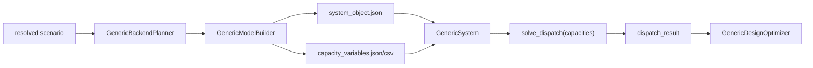

# Generic P0 System Object Design

> Date: 2026-05-29

## 1. Background

The midterm version has already proven three scenario flows: Songshan Lake and German CCHP through `current_cchp`, and tobacco factory through `future_generic / linear_energy_hub`. The next P0 objective is to turn the generic prototype into a stable interface layer that can support later 15+ scenario expansion and external capacity optimizers.

This P0 scope focuses on the interface foundation, not on a final research-grade multi-objective optimizer. The core promise is: given a resolved scenario and a capacity assignment, the generic module library can expose a standard system object, define capacity variables, run dispatch, and export machine-readable artifacts.

## 2. Goals

- Provide a standard `system_object` representation for cooperation with other research groups.
- Promote capacity variables from ad-hoc fields to a stable schema while preserving existing compatibility.
- Provide a clear Python API for "given capacity, solve dispatch".
- Export P0 artifacts that can be used for acceptance, debugging, and external optimizer integration.
- Keep all existing Songshan Lake, German, Carnot, and tobacco checks passing.

## 3. Non-goals

- Do not replace the existing `current_cchp` optimizer.
- Do not implement the final NSGA-II or full formal external optimizer in this P0 pass.
- Do not require all 15 future scenarios to become fully solvable now.
- Do not remove existing JSON/CSV fields used by tests or reports.

## 4. Recommended Architecture



The new work should introduce a small API layer rather than moving all responsibilities into existing large files. `GenericModelBuilder` remains responsible for converting a resolved scenario and component plan into auditable model artifacts. A new `GenericSystem` class becomes the stable consumer-facing object for external optimizers.

## 5. Standard System Object

The P0 `system_object` should include these top-level fields:

| Field | Meaning |
|---|---|
| `schema_version` | Version string, initially `generic_system_object.v1` |
| `scenario` | Scenario id, name, type, location, currency |
| `backend` | Backend name and solve status |
| `buses` | Energy carrier buses with unit metadata |
| `components` | Source, Sink, Transformer, Storage and composite component specs |
| `connections` | Derived input/output carrier connections between components and buses |
| `time_series_refs` | References to load/resource/price files or generated profiles |
| `parameters` | Device parameters and economics used by the generic layer |
| `capacity_variables` | Standardized capacity variable schema |
| `build_gaps` | Missing mappings, input gaps, parameter gaps |
| `conversion_type_summary` | Multi-energy conversion type summary |

The existing `generic_model_components.json` can keep its current structure, but it should also include or be accompanied by `system_object.json`.

## 6. Capacity Variable Schema

Each capacity variable should include:

| Field | Required | Meaning |
|---|---|---|
| `name` | Yes | Full variable name such as `pv.capacity_kw` |
| `device_id` | Yes | Device instance id |
| `parameter` | Yes | Capacity parameter name such as `capacity_kw` |
| `unit` | Yes | Unit such as `kW`, `kWh`, `t/h` |
| `lb` | Yes | Lower bound |
| `ub` | Yes | Upper bound |
| `default_value` | Yes | Initial/default value |
| `is_fixed` | Yes | Whether the variable is fixed |
| `source` | Yes | User input, device library, acceptance default, or inferred source |
| `role` | Compatibility | Existing role field |
| `variable_name` | Compatibility | Existing field kept for old callers |
| `upper_bound` | Compatibility | Existing field kept for old callers |
| `lower_bound` | Compatibility | Existing field kept for old callers |

Compatibility is required because the current optimizer, tests, and reports already depend on `variable_name` and `upper_bound`.

## 7. Dispatch API

Add a small consumer-facing class:

```python
system = GenericSystem.from_resolved(resolved, project_root=PROJECT_ROOT)
result = system.solve_dispatch(
    capacities={"pv.capacity_kw": 5000.0},
    month=1,
    periods=24,
    accept_default_bounds=True,
)
```

`solve_dispatch` should normalize flat capacity assignments into the nested assignment format already used internally. It should return:

- `dispatch_solved`
- `solver`
- `termination_condition`
- `objective_value`
- `dispatch_summary`
- `energy_flow_summary` or equivalent flow totals
- `capacity_assignment`
- `errors` / `build_gaps`

This class should wrap existing `GenericDispatchModel`, `GenericEnergyHubInputs`, and `GenericOemofFactory` instead of duplicating solver logic.

## 8. P0 Artifact Export

When exporting a generic model or generic design, the output directory should be able to contain:

- `system_object.json`
- `capacity_variables.json`
- `capacity_variables.csv`
- existing `generic_model_components.json`
- existing build gap and report files

For generic design runs, the existing `generic_design_solutions.json/csv` should keep working. P0 can optionally add a dispatch API demo artifact if it is inexpensive, but the required deliverable is the reusable API and exported system object.

## 9. Error Handling

- Missing mappings remain non-fatal and appear in `build_gaps`.
- Invalid capacity variable names should raise a clear `ValueError` listing accepted variable names.
- Infeasible dispatch should return `dispatch_solved=False` and should not evaluate an uninitialized objective.
- Missing project root for real dispatch should return a clear skipped result.

## 10. Testing Strategy

Add or update tests for:

- `GenericModelBuilder` exports `system_object.json` and capacity variable artifacts.
- Capacity variables include both new schema fields and compatibility fields.
- `GenericSystem.solve_dispatch()` accepts flat capacity names and returns an optimal tobacco 24h dispatch when given acceptance default capacities.
- Invalid capacity variable names fail clearly.
- Existing design CLI and tobacco Level 3 tests continue to pass.

## 11. Acceptance Criteria

P0 is complete when:

1. A resolved tobacco scenario can export a standard `system_object.json`.
2. Capacity variables are available as JSON and CSV with the new schema.
3. A Python caller can instantiate `GenericSystem` and call `solve_dispatch(capacities=...)`.
4. Existing `run_design_checks.py --include-tobacco-level3` still passes.
5. Documentation explains that the cooperation boundary is `system_object + capacity_variables + solve_dispatch`.
