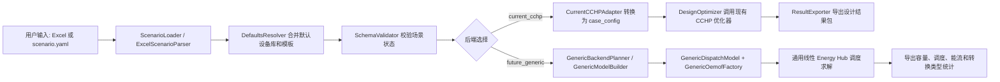

# 三场景全流程验收报告

## 1. 验收目标

中期验收要求是：提供标准化、通用化的多能转换单元模块库代码，在给定场景、系统结构、负荷数据和设备参数后，能够通过调用模块库完成系统设计，并输出容量配置结果。当前验收口径为：

- 覆盖 3 个典型系统/场景；
- 场景输入以 `scenario.yaml` 为标准内部配置，Excel 作为展示和协作模板；
- 松山湖、德国走旧版 `current_cchp` 优化闭环，验证已有冷热电 CCHP 场景可继续计算；
- 烟厂走 `future_generic / linear_energy_hub` 通用后端，验证非冷热电固定结构也能接入并真实调度求解；
- 输出标准化结果包，包括容量结果、校验报告、模型/组件映射和调度求解摘要。

## 2. 三场景验收结论

| 场景 | 场景结构 | 后端 | 求解状态 | 结果目录 |
|---|---|---|---|---|
| 松山湖社区 | 电-热-冷 CCHP + 储能 | `current_cchp` | 已完成 demo 真实优化闭环 | `DesignResults/three_scenario_acceptance/songshan_lake_demo/design__songshan_lake__demo__20260528_165158/` |
| 德国案例 | 电-热-冷 CCHP + 风光 + 储能 | `current_cchp` | 已完成 demo 真实优化闭环 | `DesignResults/three_scenario_acceptance/german_demo/design__german__demo__20260528_165251/` |
| 卷烟厂 | 电-冷-蒸汽-余热-天然气 + 储能 | `future_generic` / `linear_energy_hub` | 已完成 Level 3 通用后端真实调度求解 | `DesignResults/three_scenario_acceptance/tobacco_factory_level3/` |

结论：三个场景均已跑通。前两个场景证明旧论文实验闭环仍可通过新接口调用；烟厂场景证明模块库已经不局限于固定 9 变量 CCHP，而是可以通过通用组件抽象支持蒸汽、余热、天然气和工业负荷场景。

## 3. 全流程架构



## 4. 运行命令与证据

### 4.1 松山湖场景

运行命令：

```bash
rtk uv run python design.py --scenario "松山湖\单元模块库\ies_design\scenarios\songshan_lake\scenario.yaml" --mode demo --output "DesignResults\three_scenario_acceptance\songshan_lake_demo"
```

关键输出：

- 校验状态：`runnable`
- 后端：`current_cchp`
- 优化模式：`demo`，`nind=6`，`maxgen=3`，方法为 `euclidean`
- 结果目录：`DesignResults/three_scenario_acceptance/songshan_lake_demo/design__songshan_lake__demo__20260528_165158/`
- 最低成本：`1,876,465.87 ¥`
- 最佳匹配度：`50.24`
- Pareto 解数量：`6`

主要输出文件：

| 文件 | 说明 |
|---|---|
| `comparison_report.md` | 优化对比报告 |
| `Pareto_Comparison.png` | Pareto 对比图 |
| `Euclidean/Pareto_Euclidean.csv` | 原始 Pareto 结果 |
| `pareto_solutions.csv` | 标准化 Pareto 结果 |
| `design_summary.csv` / `design_summary.xlsx` | 设备容量配置摘要 |
| `design_report.md` | 标准设计报告 |
| `validation_report.md` | 场景输入校验报告 |
| `resolved_scenario.json` | 合并默认参数后的标准场景对象 |

### 4.2 德国场景

运行命令：

```bash
rtk uv run python design.py --scenario "松山湖\单元模块库\ies_design\scenarios\german\scenario.yaml" --mode demo --output "DesignResults\three_scenario_acceptance\german_demo"
```

关键输出：

- 校验状态：`runnable`
- 后端：`current_cchp`
- 优化模式：`demo`，`nind=6`，`maxgen=3`，方法为 `euclidean`
- 结果目录：`DesignResults/three_scenario_acceptance/german_demo/design__german__demo__20260528_165251/`
- 最低成本：`1,126,838.83 €`
- 最佳匹配度：`1044.56`
- Pareto 解数量：`6`

主要输出文件与松山湖一致，包括 `comparison_report.md`、`pareto_solutions.csv`、`design_summary.xlsx`、`design_report.md` 和 `validation_report.md`。

### 4.3 烟厂场景

运行命令：

```bash
rtk uv run python design.py --scenario "松山湖\单元模块库\ies_design\scenarios\tobacco_factory\scenario.yaml" --run-generic-design --generic-search-levels 1.0 --solve-generic-dispatch --dispatch-month 1 --dispatch-periods 24 --accept-future --accept-default-bounds --output "DesignResults\three_scenario_acceptance\tobacco_factory_level3"
```

关键输出：

- 校验状态：`future_supported`
- 后端：`future_generic`
- 真实求解范围：`linear_energy_hub`
- 求解器：`glpk`
- 终止状态：`optimal`
- 调度目标值：`78835.84819047617`
- 求解月份：1 月典型日 24h
- OEMOF 节点数：`27`
- 多能转换/模块类型数量：`8`
- 结果目录：`DesignResults/three_scenario_acceptance/tobacco_factory_level3/`

烟厂主要输出文件：

| 文件 | 说明 |
|---|---|
| `generic_design_solutions.json` | 完整容量候选、通用组件、调度求解状态和能流摘要 |
| `generic_design_solutions.csv` | 候选方案目标值和容量变量表 |
| `generic_design_report.md` | Level 3 通用后端验收报告 |
| `capacity_solution.csv` | 设备容量结果 |
| `dispatch_summary.csv` | 调度求解摘要 |
| `energy_flow_summary.csv` | 各能源载体能流统计 |
| `conversion_type_summary.csv` | 多能转换类型统计 |

烟厂识别出的 8 类转换/模块类型：

| 抽象类型 | 代表设备 | 输入载体 | 输出载体 |
|---|---|---|---|
| `renewable_power` | `pv` | `solar_resource;temperature` | `electricity` |
| `cogeneration` | `chp` | `natural_gas` | `electricity;heat` |
| `power_to_heat` | `electric_heat_pump` | `electricity` | `heat` |
| `power_to_cooling` | `electric_chiller` | `electricity` | `cooling` |
| `heat_to_cooling` | `absorption_chiller` | `heat` | `cooling` |
| `storage` | `electric_storage;heat_storage;cold_storage` | 同载体输入 | 同载体输出 |
| `fuel_to_steam` | `steam_boiler` | `natural_gas` | `steam` |
| `recoverable_energy_to_heat` | `waste_heat_recovery` | `waste_heat` | `heat;steam` |

## 5. 容量结果摘要

### 5.1 松山湖 `current_cchp` 推荐配置摘录

| 设备变量 | 容量 |
|---|---:|
| PV | 606.3 kW |
| WT | 0.0 kW |
| GT | 216.9 kW |
| HP | 177.0 kW |
| EC | 2487.7 kW |
| AC | 839.0 kW |
| ES | 872.5 kW |
| HS | 56.5 kW |
| CS | 2301.6 kW |

### 5.2 德国 `current_cchp` 推荐配置摘录

| 设备变量 | 容量 |
|---|---:|
| PV | 829.5 kW |
| WT | 1508.6 kW |
| GT | 6045.5 kW |
| HP | 918.4 kW |
| EC | 196.2 kW |
| AC | 582.4 kW |
| ES | 5230.6 kW |
| HS | 5439.5 kW |
| CS | 767.5 kW |

### 5.3 烟厂 `future_generic` Level 3 容量配置摘录

| 设备 | 变量 | 容量 |
|---|---|---:|
| `pv` | `capacity_kw` | 5000.0 kW |
| `chp` | `electric_capacity_kw` | 2400.0 kW |
| `electric_heat_pump` | `heat_capacity_kw` | 13937.4 kW |
| `electric_chiller` | `cooling_capacity_kw` | 550.0 kW |
| `absorption_chiller` | `cooling_capacity_kw` | 550.0 kW |
| `electric_storage` | `power_kw` / `capacity_kwh` | 2400.0 kW / 2400.0 kWh |
| `heat_storage` | `power_kw` / `capacity_kwh` | 25586.9 kW / 25586.9 kWh |
| `cold_storage` | `power_kw` / `capacity_kwh` | 550.0 kW / 550.0 kWh |
| `steam_boiler` | `steam_capacity_t_h` | 5022.4 t/h |
| `waste_heat_recovery` | `recovered_heat_kw` | 13937.4 kW |

说明：烟厂部分设备容量上界来自清洗后的场景资料和验收默认值。使用 `--accept-default-bounds` 时，程序会补齐缺失上界以证明流程可计算；正式工程计算前仍应由项目资料或导师确认容量边界。

## 6. 全流程验证命令

除单独运行三场景外，当前已经提供一键检查入口：

```bash
rtk uv run python run_design_checks.py --include-tobacco-level3
```

该命令会执行：

- 默认配置库测试；
- 接口单元测试；
- 松山湖、德国、松山湖卡诺和第三占位场景校验；
- 通用组件计划和通用模型构建；
- 通用设计搜索；
- 烟厂 Level 3 通用后端真实调度求解。

最近一次验证结果：`ALL DESIGN CHECKS PASSED`。

## 7. 当前可交付内容与边界

已经完成：

- 标准场景输入：`scenario.yaml` 与 Excel 导入/导出路径；
- 默认设备库：支持设备技术经济参数补齐；
- 系统模板：预留 15 类场景并已支持冷热电、卡诺电池、工业烟厂多能场景；
- 设备抽象：设备映射到通用 Source / Sink / Transformer / GenericStorage；
- 动态容量变量：不再局限于旧版固定 9 变量；
- 单位换算：蒸汽、天然气等非 kW 单位有统一换算入口；
- 三场景求解证据：松山湖、德国、烟厂均有结果包；
- 验收报告与使用说明书。

仍需说明的边界：

- `current_cchp` 是旧论文实验闭环，适用于固定冷热电结构；
- `future_generic` 是导师项目的新接口线，烟厂已经能做 Level 3 真实调度求解；
- 当前烟厂容量优化为轻量验收搜索，不等同于最终合作课题组的正式双层容量优化器；
- 后续如果接入更多工业、氢能、蒸汽或燃气需求场景，需要继续补齐设备经济参数、容量边界和资源曲线。

## 8. 验收结论

本轮已经形成“模块库 + 系统拓扑装配器 + 标准系统对象 + 可运行 demo 优化闭环”的中期验收材料。三个场景中：

1. 松山湖证明社区型冷热电系统可通过接口调用旧 CCHP 优化器并输出标准容量结果；
2. 德国证明另一套负荷和资源数据也能通过同一接口跑通；
3. 烟厂证明通用模块库可以扩展到工业蒸汽、余热回收、天然气和多储能场景，并能真实构建和求解通用线性 Energy Hub 调度模型。

因此，当前版本可以用于中期验收展示，并可作为后续 15 类场景和更多课题组场景接入的基础。
