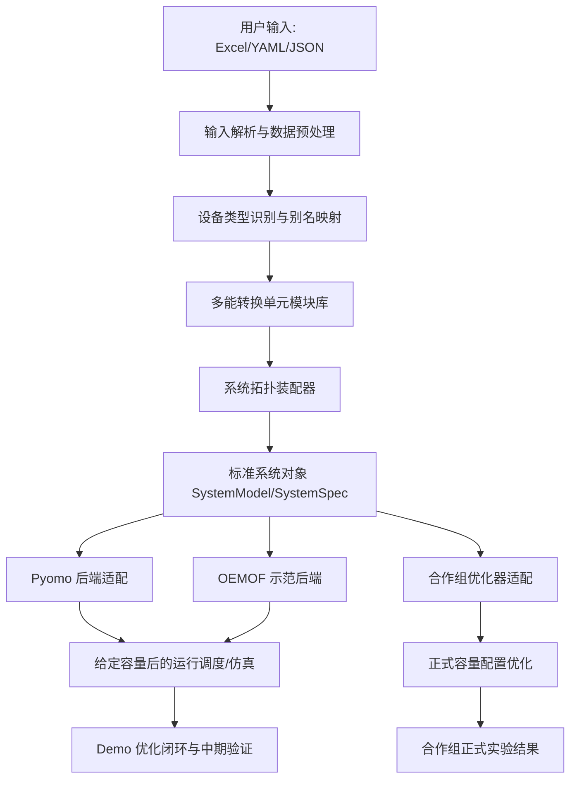

# 项目责任边界与对接架构讨论记录

## 1. 背景

当前仓库里有两条不同性质的工作线，需要在后续汇报、开发和文档中明确区分。

第一条是个人论文实验闭环，主要服务自己的研究工作。它从案例配置、容量变量、优化算法、运行调度到结果分析形成完整闭环，典型调用链是 `run.py -> cchp_gasolution.py -> cchp_gaproblem.py -> operation.py`。这条线用于德国、松山湖等案例的论文实验验证，不应和导师项目的交付责任混在一起。

第二条是导师项目中的多能转换单元模块库和场景接口线，主要服务课题组协作。它的重点不是替合作课题组完成最终容量配置算法，而是把用户给定的系统拓扑、设备清单、负荷数据和参数转换成标准化、可被容量优化器调用的系统模型。

因此，后续需要把项目定位从“完整容量优化平台”调整为“多能转换单元模块库 + 系统拓扑装配器 + 标准系统对象 + 可验证的对外调用接口”。

## 2. 一句话定位

本项目负责把用户给定的多能系统结构转换为标准化、可计算、可被优化器调用的系统模型；合作课题组负责基于该系统模型开展正式容量配置优化和算法实验。

也就是说，我们交付的是模型底座和接口能力，不是最终优化算法本身。

## 3. 总体架构



这套架构分成四层：

| 层级 | 名称 | 主要职责 | 是否属于我们核心责任 |
|---|---|---|---|
| L1 | 用户输入与预处理层 | 读取 Excel/YAML/JSON，处理拓扑、负荷、资源、价格、参数缺口 | 是 |
| L2 | 多能转换单元模块库 | 定义设备输入输出、效率、容量变量、约束、单位和默认参数 | 是，核心 |
| L3 | 系统拓扑装配层 | 把用户设备映射为模块，并按设备-母线连接装配为系统对象 | 是，核心 |
| L4 | 优化器与后端层 | Pyomo/OEMOF/合作组算法调用，给定容量后运行调度 | 我们提供接口和示范，正式优化由合作组负责 |

## 4. 责任边界

### 4.1 我们负责

1. 多能转换类型抽象：覆盖电、热、冷、天然气、氢、蒸汽等载体之间的转换关系。
2. 多能转换单元模块库：每类设备有统一的输入端口、输出端口、技术参数、经济参数、容量变量和约束说明。
3. 用户输入模板和解析：支持 Excel 展示/验收模板，内部使用 YAML/JSON 或 Python 数据结构。
4. 数据预处理：用户给典型日、8760、月典型日、月总量或混合数据时，由我们转换为模型可用的标准时序输入。
5. 设备映射：用户提供的设备名称、别名或场景默认设备，映射到标准模块类型。
6. 系统拓扑装配：基于设备-母线连接表生成标准系统对象。
7. 容量变量定义：明确每个设备有哪些可优化容量变量、上下界、单位、默认值和是否固定。
8. 给定容量后的运行调度/仿真接口：支持合作组在双层优化中调用下层运行模型。
9. Demo 优化闭环：用于中期展示和接口验证，证明模型能被容量优化器调用。
10. 中期验收输出：输出容量配置结果、多能转换类型数量、转换类型清单和场景覆盖情况。

### 4.2 合作课题组负责

1. 正式容量配置优化算法。
2. 多目标/双层优化策略设计。
3. 正式算法实验、对比实验、收敛性分析和结果解释。
4. 基于我们提供的系统对象或仿真接口，批量调用不同场景进行容量优化。

### 4.3 双方需要约定

1. 合作组最终接收的接口形式：Python 类、JSON/YAML 规范、Pyomo 模型、OEMOF 模型，或混合形式。
2. 合作组调用方式：直接调用下层调度函数，还是接收可嵌入上层优化的模型约束。
3. 时间尺度：典型日、8760、月典型日、月总量数据如何转换，以及权重如何传递。
4. 后端边界：我们是否只提供 Pyomo/OEMOF 适配，还是需要适配合作组自己的优化框架。
5. 中期验收口径：三种场景是否都必须真实求解；15 种场景是结构覆盖还是全部数据闭环。

## 5. 交付接口形式建议

用户当前不确定交付接口到底应该是什么形式。建议不要只选一种，而是采用“一个核心规范 + 三类适配出口”的方式。

### 5.1 推荐交付形态

核心交付采用中性的 `SystemSpec`，同时提供 Python `SystemModel` 封装和后端导出器：

```text
Excel 模板
  -> YAML/JSON SystemSpec
  -> Python SystemModel
  -> to_pyomo() / to_oemof() / evaluate_dispatch() / export_component_plan()
```

推荐原因：

1. Excel 适合给用户填写和中期验收展示。
2. YAML/JSON 适合作为稳定、可追溯、语言无关的数据协议。
3. Python `SystemModel` 适合合作组直接调用和二次开发。
4. Pyomo 适合承载双层优化、容量变量和约束表达。
5. OEMOF 适合作为运行调度示范后端，证明模块可计算。

因此，最终不建议只交付一个 Pyomo 模型，也不建议只交付 Excel。最稳妥的是：

> Excel 是输入模板，YAML/JSON 是标准协议，Python SystemModel 是主接口，Pyomo/OEMOF 是后端适配器。

### 5.2 接口形式对比

| 形式 | 优点 | 缺点 | 建议定位 |
|---|---|---|---|
| Excel 模板 | 用户直观、适合师弟整理场景、适合验收展示 | 程序处理不稳定，字段容易不规范 | 用户输入和汇报材料 |
| YAML/JSON | 结构清晰、可版本管理、适合自动校验、语言无关 | 对非程序用户不直观 | 内部标准协议和归档格式 |
| Python `SystemModel` 类 | 调用方便，可封装校验、建模、仿真和导出方法 | 绑定 Python 生态 | 推荐作为合作组主调用接口 |
| Pyomo 模型 | 适合优化建模，可直接写变量和约束 | 对模型结构要求高，合作组若不用 Pyomo 会受限 | 正式优化后端优先支持 |
| OEMOF 模型 | 能快速搭建能源系统调度，适合作为示范后端 | 灵活性不如直接 Pyomo，复杂双层优化较难 | Demo 和调度验证后端 |
| 黑箱函数 `evaluate(capacity)` | 合作组最容易调用，适合外层算法 | 难以嵌入数学规划器，变量/约束不透明 | 必须提供，用于双层优化下层仿真 |

## 6. 优化器调用方式调研与建议

后续合作组可能有不同优化器形态，因此接口最好同时支持白箱、灰箱和黑箱三种调用方式。

### 6.1 黑箱仿真接口

形式示例：

```python
result = system.evaluate_dispatch(capacities, time_data, objective="operation_cost")
```

含义是合作组给一组设备容量，我们返回运行调度结果、运行成本、弃风弃光、缺供、排放等指标。

优点：

- 最容易被遗传算法、粒子群、DE、贝叶斯优化等外层算法调用。
- 和合作组算法解耦，不要求他们理解内部 Pyomo/OEMOF 细节。
- 非常适合双层优化：上层给容量，下层跑调度。

缺点：

- 对数学规划器不透明，外层不能直接利用下层约束结构。
- 调用次数多时计算量大。

建议：必须提供，作为最稳妥的对外接口。

### 6.2 灰箱模型构建接口

形式示例：

```python
model = system.build_dispatch_model(capacities, backend="pyomo")
```

含义是我们根据给定容量构建下层调度模型，但由外部决定求解器和求解过程。

优点：

- 合作组可以检查模型、替换求解器、接入自己的实验框架。
- 比黑箱更透明。
- 适合他们仍然希望控制求解过程的情况。

缺点：

- 对合作组有一定建模框架要求。
- 接口稳定性要求更高。

建议：作为第二优先级提供，优先支持 Pyomo，OEMOF 作为示范。

### 6.3 白箱约束注入接口

形式示例：

```python
system.add_constraints(upper_model, capacity_vars, operation_vars)
```

含义是模块库直接向合作组的优化模型里注入变量和约束。

优点：

- 最适合严肃数学规划和单层化处理。
- 变量、约束、目标完全透明。

缺点：

- 最难设计，和合作组后端强绑定。
- 如果合作组技术路线未确定，过早开发风险大。

建议：先预留接口概念，不作为第一阶段必须完成内容。

### 6.4 推荐调用策略

第一阶段建议按下面优先级实现：

1. `evaluate_dispatch(capacities)`：黑箱下层仿真接口，支撑双层优化验证。
2. `build_dispatch_model(capacities, backend="pyomo")`：灰箱模型构建接口，便于合作组接求解器。
3. `export_system_spec()`：导出标准系统对象，便于跨语言/跨框架对接。
4. `add_constraints()`：白箱约束注入，后续等合作组技术路线明确后再做。

## 7. 容量变量定义

容量变量应该由我们定义，因为我们是对接用户输入和设备库的一方。合作组不应直接面对用户原始设备表，而应面对我们已经标准化后的容量变量。

每个模块至少需要定义：

| 字段 | 含义 |
|---|---|
| `name` | 变量名，例如 `electric_capacity`、`thermal_capacity`、`energy_capacity` |
| `carrier` | 关联能源载体，例如 electricity、heat、cooling、hydrogen |
| `unit` | 单位，例如 kW、kWh、kg/h、t/h |
| `lower_bound` | 下界 |
| `upper_bound` | 上界 |
| `default_value` | 默认值 |
| `fixed` | 是否固定 |
| `fixed_value` | 固定值，预留给“固定部分设备，优化其他设备”的功能 |
| `source` | 参数来源：用户输入、默认库、场景模板或估算 |

后续需要预留两种模式：

1. 全系统配置：所有可配置设备容量都作为变量。
2. 部分设备配置：用户固定已有设备容量，只优化新增设备或未定设备。

## 8. 调度模型责任

根据当前讨论，我们需要提供“给定容量后能够跑运行调度”的下层仿真接口。这是支撑双层优化的关键。

双层关系可以理解为：

```text
上层：容量配置优化
  输入：容量变量上下界、投资成本、候选设备
  决策：设备容量
  输出：一组容量方案
        ↓
下层：运行调度/仿真
  输入：给定容量、负荷、资源、价格、设备参数
  决策：每个时段的设备出力、储能充放电、购能量等
  输出：运行成本、能量平衡、弃能、缺供、排放等指标
```

合作组做上层优化时，可以反复调用我们的下层接口。中期为了证明模型可用，我们可以用一个轻量 demo 优化器跑出容量配置结果，但要在文档中明确：demo 优化器是接口验证，不是合作项目正式优化算法。

## 9. 模块模型深度

当前阶段采用类似 Energy Hub 的输入输出关系即可，不需要过早做复杂机理模型。

建议模型深度：

| 设备类型 | 当前阶段 | 后续预留 |
|---|---|---|
| CHP | 固定热电比，天然气输入，电/热双输出 | 可变热电比、部分负荷效率曲线 |
| 电制冷 | 电输入，冷输出，固定 COP | COP 随温度变化 |
| 吸收式制冷 | 热输入，冷输出，固定 COP | 多工况 COP |
| 热泵 | 电输入，热/冷输出，固定 COP | 环境温度相关 COP |
| 电池 | 充放电功率约束 + SOC 动态 | 寿命衰减、效率分段 |
| 蓄热/蓄冷 | 功率容量 + 能量容量 + SOC 动态 | 热损失、温度分层 |
| 电解槽 | 电输入，氢输出，固定效率 | 部分负荷效率 |
| 储氢 | 氢输入/输出 + 库存动态 | 压缩能耗、安全约束 |

SOC 动态约束指储能设备的库存随时间变化：

```text
SOC(t+1) = SOC(t) + charge(t) * eta_charge - discharge(t) / eta_discharge
0 <= SOC(t) <= energy_capacity
0 <= charge(t) <= charge_power_capacity
0 <= discharge(t) <= discharge_power_capacity
```

它用于电池、蓄热、蓄冷、储氢等跨时段储能设备。

## 10. 拓扑输入与动态拓扑生成

当前最稳妥的拓扑输入是设备-母线连接表。用户明确写出每个设备连接到哪个能源母线，例如 CHP 输入接天然气母线，输出接电母线和热母线。

动态拓扑生成是指用户只给“系统结构类型”或“应用场景类型”，程序自动补齐典型设备和连接关系。例如用户选择“社区冷热电联供系统”，程序自动生成电母线、热母线、冷母线、天然气母线，以及 CHP、电制冷、吸收式制冷、储能等默认设备。

动态拓扑生成的作用：

1. 方便用户试用，降低输入门槛。
2. 支撑 15 种场景快速覆盖。
3. 用默认系统架构生成可运行 demo。
4. 给缺少详细拓扑的场景提供初始模型。

但它也有风险：自动生成的拓扑可能与真实系统不一致。因此建议分两级支持：

1. 详细拓扑模式：用户提供设备-母线连接表，作为正式模式。
2. 场景模板模式：用户只选择场景类型，程序用内置模板生成默认拓扑，作为试用和缺省模式。

## 11. 数据边界

数据预处理由我们负责，因为用户数据来源复杂，合作组不应直接处理各种不规范 Excel。

需要支持的数据形态：

| 用户可能提供的数据 | 我们的处理方式 |
|---|---|
| 8760 数据 | 可直接用于全年模拟，也可聚类为典型日 |
| 每月 1 个典型日 24h 曲线 | 生成 12 个典型日，每个典型日赋月度权重 |
| 若干典型日 + 权重 | 校验权重、时序长度和能源载体一致性 |
| 月总量 | 按默认日曲线或模板曲线分配，标记为估算数据 |
| 混合数据 | 逐项识别来源，生成数据完整性报告 |

输出给模型时，应统一成：

1. 标准时序表。
2. 典型日权重表。
3. 数据来源和缺口报告。
4. 能源载体单位说明。

## 12. 中期验收口径

当前建议口径：

1. 中期三种场景尽量真实求解，至少松山湖和德国真实跑通。
2. 第三场景如果真实数据不足，可以用兼容真实结构的示例数据证明模型可用。
3. 15 种应用场景先做到结构和模块覆盖，真实数据齐全的场景再做真实求解。
4. 输出不仅包括容量配置结果，还要包括多能转换类型数量和转换类型清单。
5. 明确 demo 优化结果的来源，避免被误解为合作组正式优化算法。

建议验收输出包括：

| 输出 | 用途 |
|---|---|
| `system_spec.yaml/json` | 标准系统对象归档 |
| `component_plan.md/json` | 设备到模块的映射关系 |
| `conversion_type_summary.md/xlsx` | 多能转换类型数量和清单 |
| `capacity_variables.xlsx` | 容量变量、单位、上下界、是否固定 |
| `dispatch_demo_result.xlsx` | 给定容量或 demo 容量下的运行调度结果 |
| `design_summary.xlsx` | 中期展示用汇总结果 |
| `data_quality_report.md` | 数据来源、缺口和估算说明 |

## 13. 当前代码的重新定位

当前已有的 `ies_design` 通用后端和 demo 优化代码不应该作为“正式容量优化器”来汇报，而应定位为接口验证层。

建议表述：

1. `GenericModelBuilder` 是核心，负责将标准组件计划转换成可计算模型结构。
2. `generic_oemof_factory` 是示范后端，证明模块可以转换为运行调度模型。
3. `generic_design_optimizer` 是 demo 优化器，用于验证系统对象可以被容量优化器调用。
4. 旧论文实验闭环仍归个人研究线，不作为导师项目交付边界的核心。

## 14. 需要继续问导师或合作组的问题

1. 合作组是否接受我们定义 Python `SystemModel` + YAML/JSON `SystemSpec` 作为主接口？
2. 合作组是否使用 Pyomo？如果不用，他们希望我们导出什么形式的模型或约束？
3. 中期容量配置结果是否允许由 demo 优化器产生，正式优化算法后续由合作组替换？
4. 三种中期场景是否必须全部使用真实数据，还是允许第三场景先用真实结构 + 示例时序？
5. 15 种场景验收是“结构覆盖”还是“全部真实求解”？
6. 用户只给场景类型时，默认拓扑由我们生成是否符合项目要求？
7. 数据预处理责任是否完全由我们承担，包括月总量拆分、典型日生成和聚类？
8. 是否需要把多能转换类型数量作为独立验收指标输出？如果需要，分类口径是按能源载体组合，还是按设备模块类型？

## 15. 当前阶段结论

1. 我们的核心交付应定为“模块库 + 系统拓扑装配器 + 标准系统对象”。
2. 容量变量由我们定义并维护，因为它们来自设备模块和用户输入。
3. 我们需要提供给定容量后的运行调度/仿真接口，用于支撑合作组双层优化。
4. 对外接口建议采用“Excel 输入模板 + YAML/JSON 标准协议 + Python SystemModel 主接口 + Pyomo/OEMOF 后端适配”的组合。
5. Demo 优化闭环需要保留，但只作为中期验证和接口证明，不作为正式优化算法责任。
6. 后续开发应优先标准化 `单元模块库代码` 中的模块接口，再调整 `ies_design` 作为系统装配和对外导出层。
