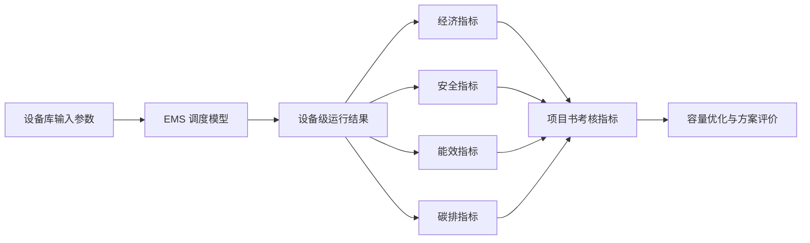

---
title: "EMS 与设备库接口审查：松山湖场景"
summary: "从设备库开发和项目书考核指标角度，审查松山湖场景 EMS 上下游接口是否合理、够用，并提出补充接口建议。"
tags:
  - 松山湖
  - EMS
  - 设备库
  - 接口规范
  - 考核指标
updated_at: "2026-05-19"
related:
  - "东莞松山湖场景梳理.md"
  - "场景梳理.md"
  - "../../case_config.py"
  - "../../operation.py"
  - "../../cchp_gaproblem.py"
---

# EMS 与设备库接口审查：松山湖场景

## 1. 文档目的

本文档用于沉淀对东莞松山湖综合能源场景中 EMS 上下游接口、设备库输入输出接口和项目书考核指标支撑关系的审查结论。它不替代 `东莞松山湖场景梳理.md`，而是作为接口设计评审和后续设备库开发的补充依据。

本次审查的核心问题是：当前文档和代码中的 EMS 接口是否足够支撑设备库开发，以及是否能够支撑项目书中围绕经济、安全、能效和碳排四个维度的考核指标。

## 2. 总体结论

当前松山湖场景的 EMS 上下接口能够支撑现有论文实验中的经济目标和源荷匹配目标，但还不能完整支撑项目书考核和设备库开发。

| 审查维度 | 结论 |
|---|---|
| 当前论文实验 | 基本够用。当前代码返回年化经济成本和源荷匹配指标，能够支撑现有优化实验。 |
| 设备库开发 | 不够完整。设备级输入输出、状态、成本、排放、约束校验接口需要进一步标准化。 |
| 项目书考核 | 不够闭环。经济指标较完整，安全、能效、碳排指标需要补充设备级输出和统计接口。 |
| 文档表达 | 已具备接口框架，但还偏案例参数说明，需要增加统一字段规范和考核指标映射。 |

简要判断如下：

- 经济指标：当前支撑较好，但缺少设备级成本分解。
- 安全指标：当前只能支撑最大购电、外部补热、外部补冷、可行性等粗粒度指标，缺少负荷满足率、缺供量、SOC、越限等接口。
- 能效指标：当前能支撑源荷匹配和部分外部补能/弃能统计，但缺少设备级出力、效率和储能状态接口。
- 碳排指标：当前只是接口预留，代码层尚未形成完整碳排核算闭环。

## 3. 当前代码中 EMS 已具备的接口能力

根据 `operation.py` 和 `cchp_gaproblem.py`，当前 EMS 调度模型实际使用和返回的主要接口如下。

### 3.1 EMS 输入接口

| 接口类别 | 当前已有内容 | 说明 |
|---|---|---|
| 负荷输入 | 电负荷、热负荷、冷负荷（kW） | 来自 `songshan_lake_data.csv`。 |
| 资源输入 | 太阳辐照（W/m2）、环境温度（°C）、风速（m/s） | 风速列存在，但松山湖风电容量上界为 0，不形成有效设备。 |
| 价格输入 | 分时电价、天然气价格 | 用于运行成本计算。 |
| 容量输入 | PV、GT、HP、EC、AC、ES、HS、CS | 来自容量优化个体。 |
| 效率参数 | CHP 效率、COP、储能充放效率、损耗率 | 来自 `case_config.py`。 |
| 匹配系数 | λ_e、λ_h、λ_c | 用于能质加权源荷匹配指标。 |

### 3.2 EMS 输出接口

当前 `OperationModel.get_complementary_results()` 主要返回以下结果：

| 输出字段 | 含义 | 可支撑指标 |
|---|---|---|
| `grid` | 电网购电功率（kW） | 购电成本、最大购电功率、电净负荷偏差。 |
| `electricity overflow` | 电力溢出功率（kW） | 弃电、净负荷偏差、可再生能源消纳分析。 |
| `heat source` | 外部补热功率（kW） | 热侧补能、热侧安全兜底。 |
| `heat overflow` | 热溢出功率（kW） | 弃热、热侧匹配分析。 |
| `cool source` | 外部补冷功率（kW） | 冷侧补能、冷侧安全兜底。 |
| `cool overflow` | 冷溢出功率（kW） | 弃冷、冷侧匹配分析。 |

### 3.3 当前优化目标支撑情况

`cchp_gaproblem.py` 中当前主要返回两个目标：

| 目标 | 当前支撑情况 |
|---|---|
| 经济目标 | 年化投资成本 + 运行成本 + 储能固定成本 + 容量电费。 |
| 源荷匹配目标 | 基于电、热、冷净负荷偏差计算标准差、欧氏距离、相关性或自给率。 |

其中净负荷偏差计算方式为：

| 维度 | 计算口径 |
|---|---|
| 电净负荷偏差 | 电网购电功率 - 电力溢出功率（kW） |
| 热净负荷偏差 | 外部补热功率 - 热溢出功率（kW） |
| 冷净负荷偏差 | 外部补冷功率 - 冷溢出功率（kW） |

因此，当前接口对论文实验中的经济目标和源荷匹配目标是闭合的。

## 4. 面向项目书考核指标的接口缺口

项目书考核通常不会只看优化目标，还会关注经济性、安全性、能效水平和碳排放。因此，仅靠当前 `grid / heat source / cool source / overflow` 这些外部接口结果是不够的。

### 4.1 经济指标缺口

当前经济指标可以计算年化总成本，但设备级成本分解不足。

| 需要支撑的考核指标 | 当前是否充分 | 缺口 |
|---|---|---|
| 年化总成本 | 是 | 当前已能支撑。 |
| 运行成本 | 是 | 当前已能支撑总运行成本。 |
| 设备投资成本 | 部分 | 当前有年化投资系数，但缺少设备库统一成本字段。 |
| 固定/可变运维成本 | 否 | 当前未形成设备级运维成本输出。 |
| 储能老化成本 | 否 | 当前未形成循环老化成本接口。 |
| 各设备成本分摊 | 否 | 当前 EMS 输出没有按设备拆分成本。 |

建议设备库统一输出：

| 字段 | 单位 | 用途 |
|---|---|---|
| `investment_annual_cost` | 元/a | 年化投资成本。 |
| `fixed_om_cost` | 元 | 固定运维成本。 |
| `variable_om_cost` | 元 | 可变运维成本。 |
| `fuel_cost` | 元 | 燃料成本。 |
| `electricity_cost` | 元 | 用电成本。 |
| `penalty_cost` | 元 | 缺供、补能、弃能惩罚成本。 |
| `total_operation_cost` | 元 | 设备运行总成本。 |

### 4.2 安全指标缺口

当前安全指标偏弱，只能间接体现最大购电、外部补热、外部补冷和求解可行性。

| 需要支撑的考核指标 | 当前是否充分 | 缺口 |
|---|---|---|
| 最大购电功率 | 是 | 当前可由 `grid` 计算。 |
| 供热/供冷外部补能 | 部分 | 当前有 `heat source` / `cool source`，但语义需明确是外购还是缺供兜底。 |
| 负荷满足率 | 否 | 当前没有显式 `served_load` / `unserved_load`。 |
| 缺电/缺热/缺冷量 | 否 | 当前没有独立缺供接口。 |
| 储能 SOC 越限 | 否 | 当前没有返回 SOC 序列和越限统计。 |
| 设备越限次数 | 否 | 当前没有统一约束违反输出。 |
| 容量裕度 | 否 | 当前没有设备容量裕度统计。 |

需要特别明确的是：当前模型里的 `heat source` 和 `cool source` 是高惩罚外部补能源。它可以作为热/冷侧兜底，但如果项目书把它解释为“缺供量”，就应该在接口命名上进一步区分：

| 情况 | 建议接口 |
|---|---|
| 外购热/外购冷 | `external_heat_supply`、`external_cool_supply` |
| 未满足热/冷负荷 | `unserved_heat_load`、`unserved_cool_load` |
| 惩罚源兜底 | `penalty_heat_supply`、`penalty_cool_supply` |

建议设备库统一输出：

| 字段 | 单位 | 用途 |
|---|---|---|
| `served_load` | kW / kWh | 已满足负荷。 |
| `unserved_load` | kW / kWh | 未满足负荷。 |
| `load_satisfaction_rate` | % | 负荷满足率。 |
| `max_unserved_power` | kW | 最大缺供功率。 |
| `constraint_violation` | kW、kWh、次 | 约束违反量。 |
| `feasibility_flag` | 0/1 | 调度是否可行。 |
| `state_of_charge` | % 或 kWh | 储能状态。 |
| `capacity_margin` | kW | 容量裕度。 |

### 4.3 能效指标缺口

当前能效指标可支撑源荷匹配、弃能和部分外部补能统计，但设备级能效不足。

| 需要支撑的考核指标 | 当前是否充分 | 缺口 |
|---|---|---|
| 电/热/冷净负荷偏差 | 是 | 当前已能支撑。 |
| 源荷匹配指标 | 是 | 当前已能支撑。 |
| 光伏利用率 | 部分 | 可由光伏可用出力和电力溢出估算，但设备级口径不够清晰。 |
| CHP 综合效率 | 否 | 当前未返回 CHP 电出力和热出力明细。 |
| 电制冷/电热泵能效 | 否 | 当前未返回耗电和冷热输出明细。 |
| 吸收式制冷余热利用率 | 否 | 当前未返回热输入、电输入、冷输出明细。 |
| 储能循环效率 | 否 | 当前未返回充放电量、储能状态和损耗量。 |
| 综合能源利用率 | 否 | 当前缺少设备级能量流闭环。 |

当前 `get_complementary_results()` 返回的是外部接口，而不是设备级接口。因此，如果项目书要展示设备级能效，必须补充设备级详细输出。

建议设备库统一输出：

| 字段 | 单位 | 用途 |
|---|---|---|
| `input_power` | kW | 设备输入功率。 |
| `output_power` | kW | 设备输出功率。 |
| `energy_input` | kWh | 设备输入能量。 |
| `energy_output` | kWh | 设备输出能量。 |
| `efficiency_actual` | p.u. | 实际效率。 |
| `cop_actual` | kW/kW | 实际 COP。 |
| `curtailment_power` | kW | 弃能功率。 |
| `curtailment_energy` | kWh | 弃能量。 |
| `utilization_rate` | % | 设备利用率。 |
| `storage_charge_energy` | kWh | 储能充能量。 |
| `storage_discharge_energy` | kWh | 储能放能量。 |
| `storage_loss_energy` | kWh | 储能损耗量。 |

### 4.4 碳排指标缺口

当前碳排只在文档中作为接口预留，代码中尚未形成完整碳排计算。

| 需要支撑的考核指标 | 当前是否充分 | 缺口 |
|---|---|---|
| 年总碳排放 | 否 | 当前无碳排计算输出。 |
| 购电碳排放 | 否 | 需要电网排放因子和购电量。 |
| 燃气碳排放 | 否 | 需要天然气排放因子和燃气消耗量。 |
| 设备生命周期碳排 | 否 | 需要设备生命周期排放因子。 |
| 单位供能碳排强度 | 否 | 需要总供能量和总碳排。 |
| 减排量 | 否 | 需要基准情景或替代排放因子。 |
| 碳成本 | 否 | 需要碳价和碳排量。 |

建议设备库统一输出：

| 字段 | 单位 | 用途 |
|---|---|---|
| `direct_emission` | kgCO2 | 燃料直接排放。 |
| `indirect_emission` | kgCO2 | 购电等间接排放。 |
| `lifecycle_emission` | kgCO2 | 设备生命周期排放。 |
| `avoided_emission` | kgCO2 | 替代减排量。 |
| `carbon_cost` | 元 | 碳成本。 |
| `emission_intensity` | kgCO2/kWh | 单位供能碳排强度。 |

## 5. 面向设备库开发的统一接口建议

为了让设备库支持不同场景、不同上层优化算法和项目书考核指标，建议每个设备单元都采用统一的接口结构。

### 5.1 标准输入接口

| 字段组 | 字段示例 | 单位 | 说明 |
|---|---|---|---|
| `meta` | `unit_id`, `unit_type`, `scenario_id` | - | 设备唯一标识、类型和场景编号。 |
| `ports` | `input_ports`, `output_ports` | - | 设备连接的母线或资源接口。 |
| `capacity_params` | `rated_power`, `rated_capacity`, `capacity_upper_bound` | kW, kWh | 容量配置和容量边界。 |
| `economic_params` | `capex_annual`, `fuel_price`, `om_cost`, `penalty_cost` | 元/a, 元/kWh | 经济参数。 |
| `safety_constraints` | `power_max`, `power_min`, `soc_min`, `soc_max` | kW, % | 运行安全约束。 |
| `efficiency_params` | `eta`, `cop`, `loss_rate` | p.u., kW/kW, 1/h | 能量转换和损耗参数。 |
| `carbon_params` | `emission_factor`, `lca_factor`, `carbon_price` | kgCO2/kWh, 元/tCO2 | 碳核算参数。 |
| `time_params` | `time_index`, `time_step` | h | 调度时间参数。 |
| `dispatch_signal` | `target_power`, `enable_flag` | kW, 0/1 | EMS 调度指令或启用状态。 |

### 5.2 标准输出接口

| 字段组 | 字段示例 | 单位 | 说明 |
|---|---|---|---|
| `dispatch_outputs` | `input_power`, `output_power`, `state` | kW, kWh | 调度结果。 |
| `energy_outputs` | `energy_input`, `energy_output`, `loss_energy` | kWh | 能量统计。 |
| `cost_outputs` | `investment_cost`, `operation_cost`, `fuel_cost`, `penalty_cost` | 元 | 成本分解。 |
| `safety_outputs` | `violation`, `served_load`, `unserved_load`, `feasibility_flag` | kW, kWh, 0/1 | 安全和可行性结果。 |
| `efficiency_outputs` | `efficiency_actual`, `cop_actual`, `utilization_rate` | p.u., %, kW/kW | 能效结果。 |
| `carbon_outputs` | `direct_emission`, `indirect_emission`, `lifecycle_emission` | kgCO2 | 碳排结果。 |
| `metric_outputs` | `matching_index`, `self_sufficiency`, `curtailment_rate` | kW, %, - | 上层评价指标。 |

## 6. EMS 与项目书考核指标的闭环关系

项目书考核指标应从 EMS 和设备库统一输出中直接计算，避免后期手工补数据。

| 考核维度 | 需要的设备库输出 | 当前状态 | 建议 |
|---|---|---|---|
| 经济 | 成本分解、年化投资、运行成本、燃料成本、惩罚成本 | 部分具备 | 增加设备级 `cost_outputs`。 |
| 安全 | 负荷满足率、缺供量、越限量、SOC、可行性标识 | 不充分 | 增加 `safety_outputs` 和约束违反统计。 |
| 能效 | 设备出力、输入能量、输出能量、效率、弃能率、储能损耗 | 不充分 | 增加设备级详细能量流输出。 |
| 碳排 | 直接排放、间接排放、生命周期排放、减排量、碳强度 | 仅预留 | 增加 `carbon_params` 和 `carbon_outputs`。 |

建议形成如下闭环：

## 7. 建议的文档更新方向

后续如果要更新 `东莞松山湖场景梳理.md`，建议不是简单增加参数，而是增加一个单独章节：

`4. EMS 与设备库统一接口规范及考核指标支撑关系`

该章节建议包括：

1. 当前实验已实现接口。
2. 设备库开发必须实现接口。
3. 项目书考核指标与接口字段映射表。
4. 当前未实现但必须预留的扩展接口。

这样可以同时避免两个问题：

- 不把当前代码没有实现的内容误写成已经实现。
- 又能保证项目书和设备库开发有完整接口依据。

## 8. 复用结论

- 当前 EMS 接口对现有松山湖优化实验是合理的。
- 当前 EMS 接口对设备库开发还不够，需要补充统一字段规范。
- 当前接口对经济指标支撑较好，对安全、能效、碳排支撑不足。
- 项目书考核指标应由设备库统一输出直接计算，不能依赖后处理手工拼接。
- 设备库开发时，每个设备都应至少具备经济、安全、能效、碳排四类输入和输出接口。
