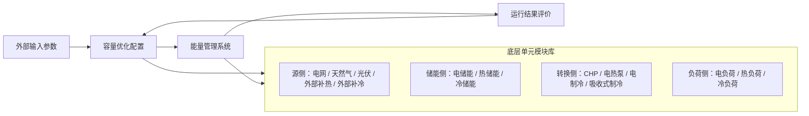

# 7. 东莞松山湖场景梳理

> 本文档按 `case_config.py`、`cchp_gaproblem.py` 和 `operation.py` 中松山湖实验的实际建模口径整理。表格格式参考案例 1、案例 2，系统层级恢复“外部输入参数—容量优化传递给能量管理系统—能量管理传递给容量优化”的结构；设备层级按“输入参数”和“输出参数”拆表，并围绕经济、安全、能效、碳排四个维度组织。

## 1. 系统架构

东莞松山湖场景为电-热-冷-气耦合的园区综合能源系统。当前实验底层单元按“源侧、储能侧、转换侧、负荷侧”建模，容量优化层给定设备容量，能量管理系统在典型日调度中求解电、热、冷、气母线平衡，并将运行成本、外部补能、弃能和源荷匹配结果反馈给容量优化层。

当前松山湖实验中，风速列仅作为数据文件字段保留；由于 `case_config.py` 中对应设备容量上界为 0（kW），该设备不作为本场景正式设备接口。其他未进入当前基础实验模型的扩展内容，也不纳入本文件设备接口。

图 1、东莞松山湖综合能源系统实际建模架构示意图

## 2. 系统层级参数情况

### 2.1 外部输入参数

| **指标类别** | **具体参数（仅保留当前实验实际使用或接口预留参数）** |
| --------------------- | ------------------------------------------------------------ |
| **资源 / 负荷** | • 年度运行数据文件（data/songshan_lake_data.csv） • 典型日文件（data/songshan_lake_typical.xlsx） • 电负荷时序（kW） • 热负荷时序（kW） • 冷负荷时序（kW） • 太阳辐照时序（W/m2） • 环境温度时序（°C） • 风速时序（m/s，仅数据字段，不形成有效设备接口） • 典型日编号（d） • 典型日代表天数（d） |
| **经济** | • 分时购电价格（元/kWh） • 天然气价格（元/Nm3 或 元/kWh） • 各设备年化投资系数（元/(kW·a)） • 热/冷储能固定成本（元/a） • 容量电费（元/(kW·a)） • 外部补热惩罚成本（元/kWh_heat） • 外部补冷惩罚成本（元/kWh_cold） |
| **安全** | • 各设备容量上界（kW） • 电网购电功率上限（kW） • 天然气输入功率上限（kW） • 外部补热功率上限（kW） • 外部补冷功率上限（kW） |
| **能效** | • CHP 发电效率（p.u.） • CHP 供热效率（p.u.） • 吸收式制冷 COP（kW_cold/kW_input） • 吸收式制冷热输入占比（p.u.） • 吸收式制冷电输入占比（p.u.） • 电热泵 COP（kW_heat/kW_e） • 电制冷 COP（kW_cold/kW_e） • 储能充放效率（p.u.） • 储能自损耗率（1/h） • 电、热、冷能质系数（-） |
| **碳排** | • 电网购电排放因子（kgCO2/kWh，接口预留） • 天然气排放因子（kgCO2/Nm3 或 kgCO2/kWh，接口预留） • 光伏生命周期排放因子（kgCO2/kWh，接口预留） • 储能生命周期排放因子（kgCO2/kWh-throughput，接口预留） • 单位供能碳排统计口径（kgCO2/kWh，接口预留） |

### 2.2 容量优化传递给能量管理系统

| **指标类别** | **传递的具体参数** |
| --------------------- | ------------------------------------------------------------ |
| **容量配置** | • 光伏装机容量 ppv（kW） • CHP 额定电功率 pgt（kW） • 电热泵容量 php（kW） • 电制冷容量 pec（kW） • 吸收式制冷容量 pac（kW） • 电储能功率 pes（kW） • 热储能功率 phs（kW） • 冷储能功率 pcs（kW） |
| **设备经济参数** | • 设备年化投资成本（元/a） • 热储能固定成本（元/a） • 冷储能固定成本（元/a） • 分时购电价格（元/kWh） • 天然气价格（元/Nm3 或 元/kWh） • 外部补热惩罚成本（元/kWh_heat） • 外部补冷惩罚成本（元/kWh_cold） |
| **设备安全 / 约束** | • 各设备出力上限（kW） • 电储能容量（kWh）= 电储能功率（kW）× 2 h • 热储能容量（kWh_heat）= 热储能功率（kW）× 4/3 h • 冷储能容量（kWh_cold）= 冷储能功率（kW）× 4/3 h • CHP 供热侧容量（kW）= CHP 额定电功率（kW）× 1.5 |
| **设备能效参数** | • 光伏可用出力（kW） • CHP 发电效率（p.u.） • CHP 供热效率（p.u.） • 电热泵 COP（kW_heat/kW_e） • 电制冷 COP（kW_cold/kW_e） • 吸收式制冷 COP（kW_cold/kW_input） • 储能充放效率（p.u.） • 储能自损耗率（1/h） |
| **设备碳排参数** | • 电网购电排放因子（kgCO2/kWh，接口预留） • 天然气排放因子（kgCO2/Nm3 或 kgCO2/kWh，接口预留） • 设备生命周期排放因子（kgCO2/kW 或 kgCO2/kWh，接口预留） |

### 2.3 能量管理传递给容量优化

| **指标类别** | **传递的具体参数（基于典型日加权到全年）** |
| --------------------- | ------------------------------------------------------------ |
| **经济** | • 调度运行成本（元/a） • 年化投资成本（元/a） • 热储能固定成本（元/a） • 冷储能固定成本（元/a） • 最大购电功率对应容量费用（元/a） • 年化总成本（元/a） |
| **安全 / 状态** | • 方案可行性标识（0/1） • 最大购电功率（kW） • 外部补热功率（kW） • 外部补冷功率（kW） • 电力溢出功率（kW） • 热溢出功率（kW） • 冷溢出功率（kW） |
| **能效** | • 光伏可用出力（kW） • 电网购电量（kWh） • 外部补热量（kWh_heat） • 外部补冷量（kWh_cold） • 电净负荷偏差（kW） • 热净负荷偏差（kW） • 冷净负荷偏差（kW） • 源荷匹配指标（kW 或 -） |
| **碳排** | • 购电碳排放统计量（kgCO2 或 tCO2，接口预留） • 燃气碳排放统计量（kgCO2 或 tCO2，接口预留） • 可再生能源替代减排量（kgCO2 或 tCO2，接口预留） • 单位供能碳排强度（kgCO2/kWh，接口预留） |

## 3. 设备参数情况

### 3.1 源侧设备参数

#### 3.1.1 电网接口

输入参数

| **参数维度** | **参数** |
| --------------------- | ------------------------------------------------------------ |
| **经济** | • 分时购电价格（元/kWh） • 容量电费（元/(kW·a)） |
| **安全** | • 电网购电功率上限（kW） |
| **能效** | • 电力母线输入接口（kW） |
| **碳排** | • 电网购电排放因子（kgCO2/kWh，接口预留） |

输出参数

| **参数维度** | **参数** |
| --------------------- | ------------------------------------------------------------ |
| **经济** | • 购电运行成本（元） • 最大购电功率对应容量费用（元） |
| **安全** | • 最大购电功率（kW） |
| **能效** | • 电网购电功率（kW） • 电网购电量（kWh） • 电力溢出功率（kW） |
| **碳排** | • 购电碳排放统计量（kgCO2 或 tCO2，接口预留） |

#### 3.1.2 天然气接口

输入参数

| **参数维度** | **参数** |
| --------------------- | ------------------------------------------------------------ |
| **经济** | • 天然气价格（元/Nm3 或 元/kWh） |
| **安全** | • 天然气输入功率上限（kW） |
| **能效** | • 气母线输入接口（kW） |
| **碳排** | • 天然气排放因子（kgCO2/Nm3 或 kgCO2/kWh，接口预留） |

输出参数

| **参数维度** | **参数** |
| --------------------- | ------------------------------------------------------------ |
| **经济** | • 燃气运行成本（元） |
| **安全** | • 天然气输入功率（kW） |
| **能效** | • 天然气消耗量（Nm3 或 kWh） |
| **碳排** | • 燃气碳排放统计量（kgCO2 或 tCO2，接口预留） |

#### 3.1.3 光伏设备

输入参数

| **参数维度** | **参数** |
| --------------------- | ------------------------------------------------------------ |
| **经济** | • 光伏年化投资系数（元/(kW·a)） |
| **安全** | • 光伏装机容量 ppv（kW） • 光伏容量上界（kW） |
| **能效** | • 太阳辐照强度（W/m2） • 环境温度（°C） • 光伏系统综合系数（p.u.） • 温度修正系数（1/°C） • 参考温度（°C） |
| **碳排** | • 光伏生命周期排放因子（kgCO2/kWh，接口预留） |

输出参数

| **参数维度** | **参数** |
| --------------------- | ------------------------------------------------------------ |
| **经济** | • 光伏年化投资成本（元/a） |
| **安全** | • 光伏实际配置容量（kW） |
| **能效** | • 光伏可用功率（kW） • 光伏实际进入电母线功率（kW） |
| **碳排** | • 光伏替代购电减排量（kgCO2 或 tCO2，接口预留） |

#### 3.1.4 外部补热接口

输入参数

| **参数维度** | **参数** |
| --------------------- | ------------------------------------------------------------ |
| **经济** | • 外部补热惩罚成本（元/kWh_heat） |
| **安全** | • 外部补热功率上限（kW） |
| **能效** | • 热母线补热接口（kW） |
| **碳排** | • 外部热源排放因子（kgCO2/kWh_heat，接口预留） |

输出参数

| **参数维度** | **参数** |
| --------------------- | ------------------------------------------------------------ |
| **经济** | • 外部补热成本（元） |
| **安全** | • 外部补热功率（kW） |
| **能效** | • 外部补热量（kWh_heat） |
| **碳排** | • 外部补热碳排放统计量（kgCO2 或 tCO2，接口预留） |

#### 3.1.5 外部补冷接口

输入参数

| **参数维度** | **参数** |
| --------------------- | ------------------------------------------------------------ |
| **经济** | • 外部补冷惩罚成本（元/kWh_cold） |
| **安全** | • 外部补冷功率上限（kW） |
| **能效** | • 冷母线补冷接口（kW） |
| **碳排** | • 外部冷源排放因子（kgCO2/kWh_cold，接口预留） |

输出参数

| **参数维度** | **参数** |
| --------------------- | ------------------------------------------------------------ |
| **经济** | • 外部补冷成本（元） |
| **安全** | • 外部补冷功率（kW） |
| **能效** | • 外部补冷量（kWh_cold） |
| **碳排** | • 外部补冷碳排放统计量（kgCO2 或 tCO2，接口预留） |

### 3.2 储能设备

#### 3.2.1 电储能

输入参数

| **参数维度** | **参数** |
| --------------------- | ------------------------------------------------------------ |
| **经济** | • 电储能年化投资系数（元/(kW·a)） |
| **安全** | • 电储能功率 pes（kW） • 电储能容量（kWh） • 电储能功率上界（kW） |
| **能效** | • 充电效率（p.u.） • 放电效率（p.u.） • 自放电率（1/h） |
| **碳排** | • 电储能生命周期排放因子（kgCO2/kWh-throughput，接口预留） |

输出参数

| **参数维度** | **参数** |
| --------------------- | ------------------------------------------------------------ |
| **经济** | • 电储能年化投资成本（元/a） |
| **安全** | • 储能状态（kWh） |
| **能效** | • 充电功率（kW） • 放电功率（kW） |
| **碳排** | • 电储能碳排放统计量（kgCO2 或 tCO2，接口预留） |

#### 3.2.2 热储能

输入参数

| **参数维度** | **参数** |
| --------------------- | ------------------------------------------------------------ |
| **经济** | • 热储能年化投资系数（元/(kW·a)） • 热储能固定成本（元/a） |
| **安全** | • 热储能功率 phs（kW） • 热储能容量（kWh_heat） • 热储能功率上界（kW） |
| **能效** | • 蓄热效率（p.u.） • 释热效率（p.u.） • 热损失率（1/h） |
| **碳排** | • 热储能生命周期排放因子（kgCO2/kWh_heat，接口预留） |

输出参数

| **参数维度** | **参数** |
| --------------------- | ------------------------------------------------------------ |
| **经济** | • 热储能年化投资成本（元/a） • 热储能固定成本（元/a） |
| **安全** | • 储热状态（kWh_heat） |
| **能效** | • 蓄热功率（kW） • 释热功率（kW） |
| **碳排** | • 热储能碳排放统计量（kgCO2 或 tCO2，接口预留） |

#### 3.2.3 冷储能

输入参数

| **参数维度** | **参数** |
| --------------------- | ------------------------------------------------------------ |
| **经济** | • 冷储能年化投资系数（元/(kW·a)） • 冷储能固定成本（元/a） |
| **安全** | • 冷储能功率 pcs（kW） • 冷储能容量（kWh_cold） • 冷储能功率上界（kW） |
| **能效** | • 蓄冷效率（p.u.） • 释冷效率（p.u.） • 冷损失率（1/h） |
| **碳排** | • 冷储能生命周期排放因子（kgCO2/kWh_cold，接口预留） |

输出参数

| **参数维度** | **参数** |
| --------------------- | ------------------------------------------------------------ |
| **经济** | • 冷储能年化投资成本（元/a） • 冷储能固定成本（元/a） |
| **安全** | • 储冷状态（kWh_cold） |
| **能效** | • 蓄冷功率（kW） • 释冷功率（kW） |
| **碳排** | • 冷储能碳排放统计量（kgCO2 或 tCO2，接口预留） |

### 3.3 转换设备

#### 3.3.1 燃气内燃机 CHP

输入参数

| **参数维度** | **参数** |
| --------------------- | ------------------------------------------------------------ |
| **经济** | • CHP 年化投资系数（元/(kW·a)） • 天然气价格（元/Nm3 或 元/kWh） |
| **安全** | • CHP 额定电功率 pgt（kW） • CHP 电功率上界（kW） • CHP 供热侧容量（kW） |
| **能效** | • CHP 发电效率（p.u.） • CHP 供热效率（p.u.） |
| **碳排** | • 天然气排放因子（kgCO2/Nm3 或 kgCO2/kWh，接口预留） |

输出参数

| **参数维度** | **参数** |
| --------------------- | ------------------------------------------------------------ |
| **经济** | • CHP 年化投资成本（元/a） • CHP 燃气运行成本（元） |
| **安全** | • CHP 实际配置容量（kW） |
| **能效** | • 电功率输出（kW） • 热功率输出（kW） • 天然气输入功率（kW） |
| **碳排** | • CHP 运行碳排放统计量（kgCO2 或 tCO2，接口预留） |

#### 3.3.2 电热泵

输入参数

| **参数维度** | **参数** |
| --------------------- | ------------------------------------------------------------ |
| **经济** | • 电热泵年化投资系数（元/(kW·a)） • 分时购电价格（元/kWh） |
| **安全** | • 电热泵容量 php（kW） • 电热泵容量上界（kW） |
| **能效** | • 电热泵 COP（kW_heat/kW_e） |
| **碳排** | • 用电排放因子（kgCO2/kWh，接口预留） |

输出参数

| **参数维度** | **参数** |
| --------------------- | ------------------------------------------------------------ |
| **经济** | • 电热泵年化投资成本（元/a） • 电热泵耗电成本（元） |
| **安全** | • 电热泵实际配置容量（kW） |
| **能效** | • 电力输入功率（kW） • 热量输出功率（kW） |
| **碳排** | • 电热泵间接碳排放统计量（kgCO2 或 tCO2，接口预留） |

#### 3.3.3 电制冷机

输入参数

| **参数维度** | **参数** |
| --------------------- | ------------------------------------------------------------ |
| **经济** | • 电制冷年化投资系数（元/(kW·a)） • 分时购电价格（元/kWh） |
| **安全** | • 电制冷容量 pec（kW） • 电制冷容量上界（kW） |
| **能效** | • 电制冷 COP（kW_cold/kW_e） |
| **碳排** | • 用电排放因子（kgCO2/kWh，接口预留） |

输出参数

| **参数维度** | **参数** |
| --------------------- | ------------------------------------------------------------ |
| **经济** | • 电制冷年化投资成本（元/a） • 电制冷耗电成本（元） |
| **安全** | • 电制冷实际配置容量（kW） |
| **能效** | • 电力输入功率（kW） • 冷量输出功率（kW） |
| **碳排** | • 电制冷间接碳排放统计量（kgCO2 或 tCO2，接口预留） |

#### 3.3.4 吸收式制冷机

输入参数

| **参数维度** | **参数** |
| --------------------- | ------------------------------------------------------------ |
| **经济** | • 吸收式制冷年化投资系数（元/(kW·a)） |
| **安全** | • 吸收式制冷容量 pac（kW） • 吸收式制冷容量上界（kW） |
| **能效** | • 吸收式制冷 COP（kW_cold/kW_input） • 热输入占比（p.u.） • 电输入占比（p.u.） |
| **碳排** | • 余热分摊排放因子（kgCO2/kWh_heat，接口预留） |

输出参数

| **参数维度** | **参数** |
| --------------------- | ------------------------------------------------------------ |
| **经济** | • 吸收式制冷年化投资成本（元/a） |
| **安全** | • 吸收式制冷实际配置容量（kW） |
| **能效** | • 冷量输出功率（kW） • 热输入功率（kW） • 辅助电输入功率（kW） |
| **碳排** | • 吸收式制冷碳排放统计量（kgCO2 或 tCO2，接口预留） |

### 3.4 负荷设备

#### 3.4.1 园区电负荷

输入参数

| **参数维度** | **参数** |
| --------------------- | ------------------------------------------------------------ |
| **经济** | • 购电成本分摊口径（元，接口预留） |
| **安全** | • 电负荷曲线（kW） |
| **能效** | • 电母线需求接口（kW） |
| **碳排** | • 供电来源排放分摊口径（kgCO2/kWh，接口预留） |

输出参数

| **参数维度** | **参数** |
| --------------------- | ------------------------------------------------------------ |
| **经济** | • 电负荷相关购电成本分摊（元，接口预留） |
| **安全** | • 电负荷满足功率（kW） |
| **能效** | • 电网购电功率（kW） • 电力溢出功率（kW） • 电净负荷偏差（kW） |
| **碳排** | • 供电来源分摊排放（kgCO2 或 tCO2，接口预留） |

#### 3.4.2 园区热负荷

输入参数

| **参数维度** | **参数** |
| --------------------- | ------------------------------------------------------------ |
| **经济** | • 补热成本分摊口径（元，接口预留） |
| **安全** | • 热负荷曲线（kW） |
| **能效** | • 热母线需求接口（kW） |
| **碳排** | • 供热来源排放分摊口径（kgCO2/kWh_heat，接口预留） |

输出参数

| **参数维度** | **参数** |
| --------------------- | ------------------------------------------------------------ |
| **经济** | • 热负荷相关补热成本分摊（元，接口预留） |
| **安全** | • 热负荷满足功率（kW） |
| **能效** | • 外部补热功率（kW） • 热溢出功率（kW） • 热净负荷偏差（kW） |
| **碳排** | • 供热来源分摊排放（kgCO2 或 tCO2，接口预留） |

#### 3.4.3 园区冷负荷

输入参数

| **参数维度** | **参数** |
| --------------------- | ------------------------------------------------------------ |
| **经济** | • 补冷成本分摊口径（元，接口预留） |
| **安全** | • 冷负荷曲线（kW） |
| **能效** | • 冷母线需求接口（kW） |
| **碳排** | • 供冷来源排放分摊口径（kgCO2/kWh_cold，接口预留） |

输出参数

| **参数维度** | **参数** |
| --------------------- | ------------------------------------------------------------ |
| **经济** | • 冷负荷相关补冷成本分摊（元，接口预留） |
| **安全** | • 冷负荷满足功率（kW） |
| **能效** | • 外部补冷功率（kW） • 冷溢出功率（kW） • 冷净负荷偏差（kW） |
| **碳排** | • 供冷来源分摊排放（kgCO2 或 tCO2，接口预留） |
