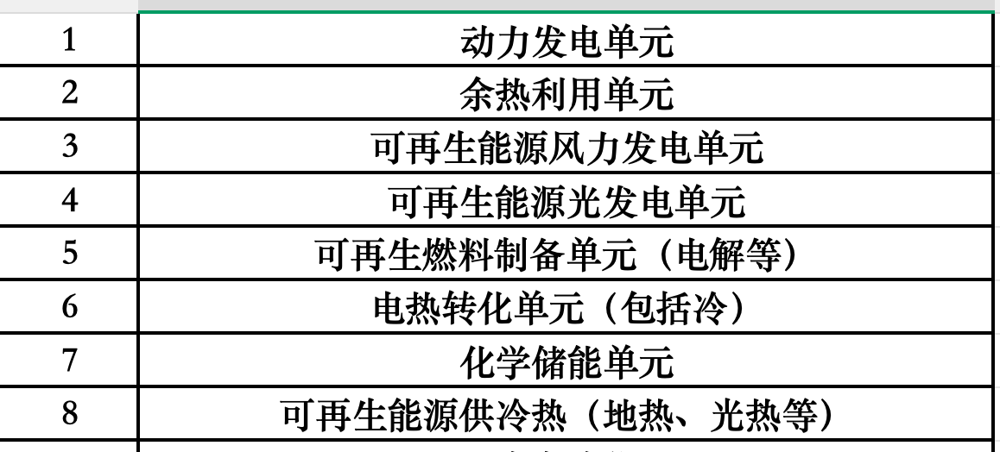
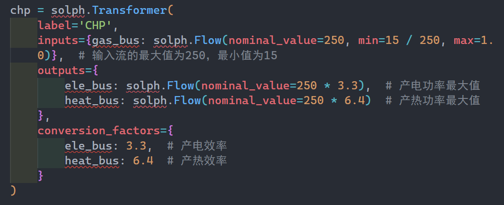

林雪茹：课题2最近需要根据这个设备列表，整理下多能转化单元模块库的输入、输出列表及代码。涵盖这些单元模块。（优先实现松山湖案例中涉及的单元），是用于规划设计阶段的，模型用简化的就行
郑浩男: 任务内容就是根据松山湖的设备数据建立solph模型对吧
林雪茹: 可以先不用数据，先形成代码，8个单元模块的
林雪茹: 松山湖数据测试的话，其实就跟你的小论文同步了
林雪茹: 有输入、有输出，可以计算就行，封装为8个模块
郑浩男: 

这个里的动力发电单元指的就是热电联产机组吗

这个里的动力发电单元指的就是热电联产机组吗
郑浩男: 感觉有点笼统
林雪茹: 每一个单元其实都可以有多个模块，我们都先弄一个
郑浩男: 还有这种余热利用单元，是不是选一个设备就行还是多种设备
郑浩男: 那就是8个单元，每个模块里弄几种典型的设备模块
郑浩男: 是这个意思吗
林雪茹: 是的，但是要连起来
郑浩男: 这个连起来是什么意思
林雪茹: 涉及两个及以上设备连接
林雪茹: 好像也不是，储热就是一个设备
林雪茹: 你先按这个做一版
郑浩男: 好的
林雪茹: 之前章主席他们整理过一版本课题组现有代码，也可以参考下
林雪茹: 里面估计都有
林雪茹: 也可以ai弄下后修改
郑浩男: 

嗯嗯我在看嗯嗯我在看
郑浩男: 差不多就是这种对吧
林雪茹: 是的
林雪茹: 然后参考群里的表格，梳理下每个单元的输入、输出列表，涵盖设备